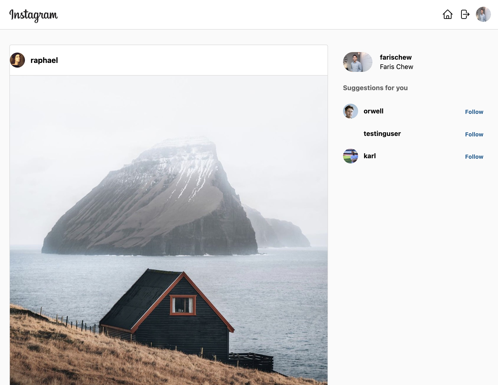

<!-- PROJECT LOGO -->
 

  

<h3 align="center">Reactagram</h3>

  

    A clone of Instagram using React and Tailwind, with Firebase as a backend to provide a database and authentication
     
    <a href="https://github.com/farischew/reactagram"><strong>Explore the docs »</strong></a>
     
     
    <a href="https://github.com/farischew/reactagram">View Demo</a>
    ·
    <a href="https://github.com/farischew/reactagram/issues">Report Bug</a>
    ·
    <a href="https://github.com/farischew/reactagram/issues">Request Feature</a>
  

<!-- TABLE OF CONTENTS -->

  
Table of Contents

  <ol>
    <li>
      <a href="#about-the-project">About The Project</a>
      <ul>
        <li><a href="#built-with">Built With</a></li>
      </ul>
    </li>
    <li><a href="#learning-points">Learning Points</a></li>
    <li><a href="#roadmap">Roadmap</a></li>
    <li><a href="#contact">Contact</a></li>
  </ol>

<!-- ABOUT THE PROJECT -->

## About The Project

### Project Synopsis

The project is a semi-functional clone of Instagram built using React and Firebase as a backend service.
Users are able to currently:

- Sign up to create an account
- Log in to an existing account
- Explore their timeline to look at photos of users that they are following
- Go to other user's profiles
- Follow/Unfollow other users

### Why I embarked on this project?

Having completed a course on React, I wanted to built something to solidify by fundmental knowledge of React. I chose Instagram as a platform to clone due to the number of possibilities in utilising React and its clean design interface. I decided to use FIrebase as a backend service to focus my learning on the frintend aspect of this project - also giving me an opportunity to try out Firebase as a Backend service.

(<a href="#readme-top">back to top</a>)

### Built With

- React
- Tailwind
- Firebase
  - Cloud Firestore
  - Authentication
- Tested with LoadTest

(<a href="#readme-top">back to top</a>)

<!-- Learning Points -->

## Learning Points

As every other project, I came across a number of obstacles and learning points.

- Firebase is not heavy production ready
  Firebase allows a quick and easy way of setting up a backend that allows provision of a database and authentication features - and a wide range of other services and features. Although the database's documents and collection structure is very different to what I am used to in SQL, it was quite easy to learn and understand. I am worried however in its ability to handle large traffic in a production-ready app (at least for the free version)

- React rendering
  React's ability to rerender components without refreshing the entire page is one of its key features that enables a smooth and dynamic user experience. However, this feature can become problematic when it leads to multiple API calls being triggered unintentionally. I encountered this problem in this project when one of my components silently rerendered - making a large number of API calls - freezing my firebase as I exceeded the call quota.

New concepts

- <a href="https://github.com/welldone-software/why-did-you-render">WhyDidYouRender</a>
  why-did-you-render by Welldone Software monkey patches React to notify you about potentially avoidable re-renders. Helps developers to simply track when and why a certain component re-renders.

- <a href="https://github.com/alexfernandez/loadtest">Loadtest</a>
  Runs a load test on the selected HTTP or WebSockets URL. The API allows for easy integration in your own tests.

- PropTypes
  As I'm already working on TypeScript for another project, I wanted to explore the use of PropTypes instead for typechecking to ctach bugs.

- <a href="https://github.com/alexfernandez/loadtest">Firebase Cloud Firestore</a>

- <a href="https://tailwindcss.com/">Tailwind CSS</a>

<!-- ROADMAP -->

## Roadmap

Below are a number of things I would like to add on to this project in the future

- [ ] Users to be able to create and upload a new post
- [ ] Users to edit their profile
- [ ] Mobile responsiveness

See the [open issues](https://github.com/farischew/reactagram/issues) for a full list of proposed features (and known issues).

(<a href="#readme-top">back to top</a>)

<!-- CONTACT -->

## Contact

Faris Chew - [@farischewww](https://twitter.com/farischewww) - farischew@gmail.com

[LinkedIn](https://www.linkedin.com/in/farischew/)

Project Link: [https://github.com/farischew/reactagram](https://github.com/farischew/reactagram)

(<a href="#readme-top">back to top</a>)

